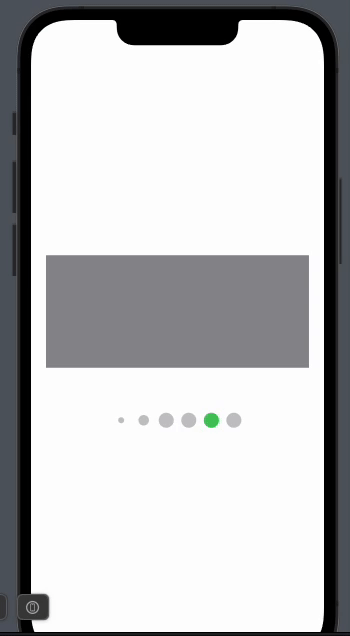

# AnimatedPageControlView

[](https://img.shields.io/badge/Swift-5.5_5.6_5.7_5.8_5.9-Orange?style=flat-square)
[](https://img.shields.io/badge/Platforms-macOS_iOS_tvOS_watchOS-Green?style=flat-square)
[](https://img.shields.io/badge/Swift_Package_Manager-compatible-orange?style=flat-square)



## Description
AnimatedPageControlView is a custom SwiftUI view that provides an animated page control for navigation between different content screens (aka Carousel). 
It's designed to enhance user experience by adding a visually appealing indicator of the current page.

## Features
- Animated page indicator with smooth transitions.
- Customizable colors and size.
- Easy integration with SwiftUI's `TabView` or any other swiftUI view component.

## Installation

### Swift Package Manager

The [Swift Package Manager](https://swift.org/package-manager/) is a tool for automating the distribution of Swift code and is integrated into the `swift` compiler. 

Once you have your Swift package set up, adding PageIndicatorControl as a dependency is as easy as adding it to the `dependencies` value of your `Package.swift`.

```swift
dependencies: [
    .package(url: "https://github.com/advantagefse/AnimatedPageControl-SwiftUI.git", .upToNextMajor(from: "1.0.0"))
]
```

To use AnimatedPageControlView in your project, follow these steps:

1. In your SwiftUI view, import `AnimatedPageControl` at the top.
2. Use `AnimatedPageControlView` as a part of your view hierarchy, providing the necessary parameters.


Example usage:

```swift
import SwiftUI
import AnimatedPageControlView

struct ContentView: View {

    @StateObject var viewModel = AnimatedPageControlViewModel()
    @State private var selection: Int = 0
    private let pageCount = 16

    var body: some View {
        VStack(spacing: 60) {
            TabView(selection: $selection) {
                ForEach(0..<pageCount, id: \.self) { index in
                    Rectangle()
                        .fill(.gray)
                        .padding(.horizontal, 20)
                }
            }
            .tabViewStyle(.page(indexDisplayMode: .never))
            .frame(height: 150)

            AnimatedPageControlView(viewModel: viewModel,
                                    selectedIndex: selection,
                                    pageCount: pageCount,
                                    maxDisplayedDots: 7,
                                    dotSpacing: 10,
                                    dotSize: 20,
                                    selectedColor: Color.green,
                                    defaultColor: Color.gray.opacity(0.5))
        }
    }
}
```

## Credits
AnimatedPageControl is owned and maintained by the [Advantage Financial Systems Experts](https://www.afse.eu/).

## License
This project is licensed under the MIT License. See the LICENSE file for details.

## Contact
For questions or suggestions, feel free to contact us at iosdevelopers@afse.eu
